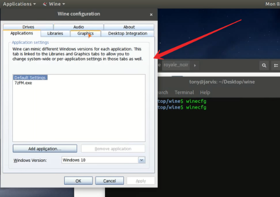
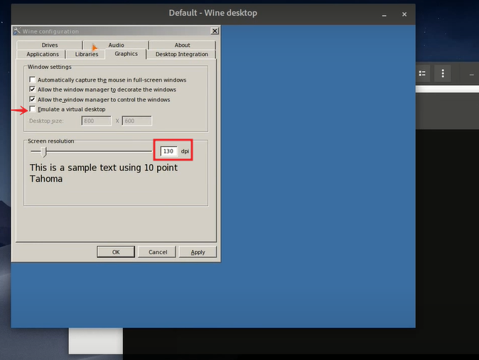
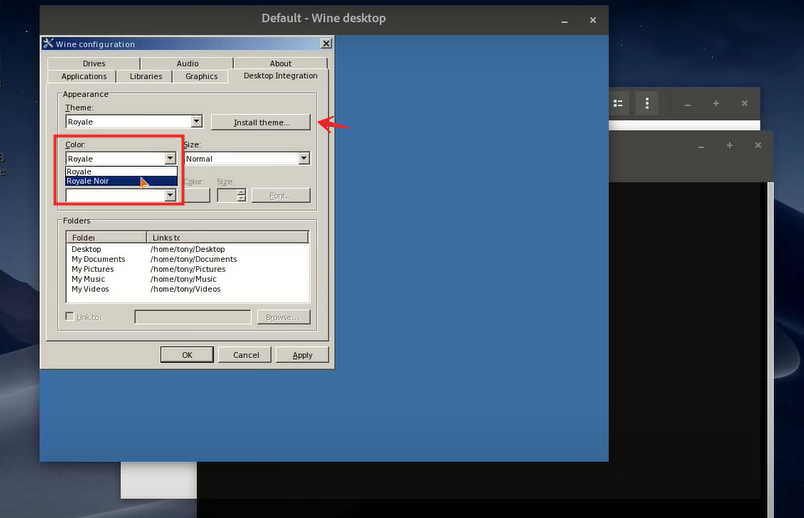

# Wine-Theme
Wine Theme For Linux Users

## Screenshot


## Installation
After cloning this repository, Extract ```theme folder``` to any directory. Then, run the following commands and Follow the screenshot:
```bash
  winecgf
```
## Customization



## Setup Theme


## 🔗 Links
[](https://www.linkedin.com/arrahmanbd)